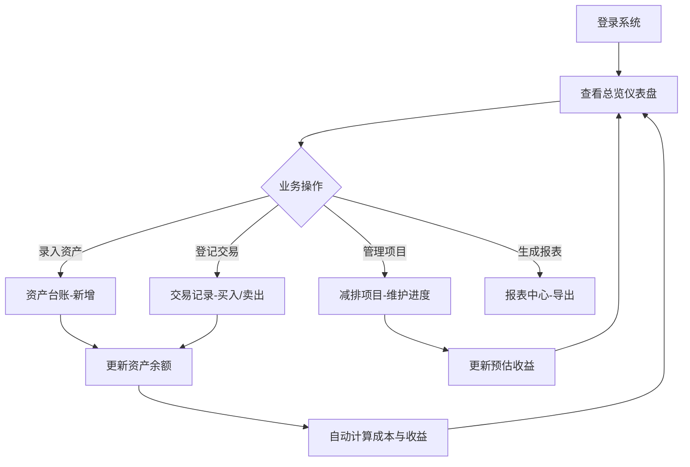

## 1. 产品概述

碳资产管理 Web 应用是面向企业碳管理人员的综合管理平台，助力企业实现碳资产全生命周期管理，包括配额、CCER（国家核证自愿减排量）及其他碳资产的登记、交易、履约和分析。

- 核心价值：帮助企业精细化管理碳资产，降低履约成本，提升减排收益，满足碳排放权交易市场合规要求
- 目标用户：企业碳管理人员、财务人员、能源管理负责人

## 2. 核心功能

### 2.1 用户角色

| 角色 | 登录方式 | 核心权限 |
|------|----------|----------|
| 碳资产管理员 | 账号密码登录 | 全功能访问，资产录入、交易登记、报表导出、系统配置 |
| 财务人员 | 账号密码登录 | 查看资产台账、交易记录、报表中心，导出数据 |
| 部门管理员 | 账号密码登录 | 查看本部门相关碳资产、减排项目，提交资产录入申请 |

### 2.2 功能模块

1. **总览页面**：数据仪表盘、关键指标概览、到期提醒、快捷操作入口
2. **资产台账**：碳资产列表、新增录入、分类筛选、详情查看、状态管理
3. **交易记录**：交易流水、买入卖出登记、履约抵扣、冻结解冻、交易明细
4. **减排项目**：项目管理、进度追踪、收益预估、减排量核算
5. **报表中心**：月度盘点表、履约测算表、数据导出（Excel/PDF）

### 2.3 页面详情

| 页面名称 | 模块名称 | 功能描述 |
|----------|----------|----------|
| 总览 | 数据概览卡片 | 展示可用余额、总成本、总收益、待履约量等核心指标 |
| 总览 | 资产分布图 | 饼图/环形图展示各类碳资产占比（配额/CCER/其他） |
| 总览 | 趋势图表 | 折线图展示碳资产余额月度变化趋势 |
| 总览 | 到期提醒 | 列表展示即将到期的碳资产和履约截止日期 |
| 总览 | 快捷操作 | 快速入口：新增资产、登记交易、生成报表 |
| 资产台账 | 资产列表 | 表格展示所有碳资产，支持分页、排序 |
| 资产台账 | 筛选查询 | 按年度、来源、状态、类型、部门、项目筛选 |
| 资产台账 | 新增资产 | 弹窗表单录入配额、CCER、其他碳资产信息 |
| 资产台账 | 资产详情 | 查看单条资产的完整信息、变更历史 |
| 资产台账 | 状态管理 | 资产冻结/解冻、状态变更 |
| 交易记录 | 交易列表 | 展示所有交易流水，支持多条件筛选 |
| 交易记录 | 买入登记 | 登记碳资产买入交易，包含数量、价格、对手方 |
| 交易记录 | 卖出登记 | 登记碳资产卖出交易，计算收益 |
| 交易记录 | 履约抵扣 | 登记用于履约的碳资产抵扣记录 |
| 交易记录 | 冻结解冻 | 登记资产冻结和解冻操作 |
| 减排项目 | 项目列表 | 展示所有减排项目及进度状态 |
| 减排项目 | 项目详情 | 查看项目基本信息、进度、预估减排量 |
| 减排项目 | 进度更新 | 更新项目进度、实际减排量、预估收益 |
| 减排项目 | 新增项目 | 创建新的减排项目 |
| 报表中心 | 月度盘点表 | 自动汇总月度碳资产变动情况 |
| 报表中心 | 履约测算表 | 根据排放量和资产余额测算履约缺口 |
| 报表中心 | 数据导出 | 支持导出 Excel、PDF 格式文件 |
| 报表中心 | 自定义报表 | 按时间范围、部门、项目维度生成报表 |

## 3. 核心流程

### 3.1 碳资产管理主流程

### 3.2 履约流程

## 4. 用户界面设计

### 4.1 设计风格

- **主色调**：深绿色系 `#15803d`，代表环保、可持续发展理念
- **辅助色**：森林绿 `#166534`、浅绿 `#22c55e`、青色 `#0d9488`
- **强调色**：琥珀色 `#f59e0b`（提醒）、红色 `#dc2626`（警告）、蓝色 `#2563eb`（信息）
- **中性色**：深灰 `#1f2937`、中灰 `#4b5563`、浅灰 `#9ca3af`、纯白 `#ffffff`
- **按钮风格**：圆角 8px，扁平化设计，hover 时有轻微上浮和阴影变化
- **字体**：标题使用 "Noto Sans SC"，正文使用系统无衬线字体，建立清晰的层级
- **布局风格**：左侧导航 + 顶部标题栏 + 主内容区，卡片式布局，充足留白
- **图标风格**：使用线性图标，统一 24px 尺寸，颜色与主色调协调

### 4.2 页面设计概览

| 页面名称 | 模块名称 | UI 元素 |
|----------|----------|----------|
| 总览 | 数据概览卡片 | 渐变背景、大号数字、趋势箭头、图标装饰 |
| 总览 | 图表区域 | ECharts 饼图+折线图、网格布局、响应式调整 |
| 总览 | 提醒列表 | 带状态标签的列表项、倒计时显示、优先级排序 |
| 资产台账 | 筛选栏 | 下拉选择器、日期范围、搜索框、重置按钮 |
| 资产台账 | 数据表格 | 斑马纹、悬停高亮、状态标签、操作按钮列 |
| 交易记录 | 交易表单 | 分组字段、实时计算、验证提示、分步引导 |
| 减排项目 | 进度卡片 | 进度条、里程碑节点、收益预估、状态徽章 |
| 报表中心 | 报表预览 | 可折叠分组、数据高亮、分页浏览、打印样式 |

### 4.3 响应式设计

- **桌面端优先**：最小支持 1366px 宽度，优化 1920px 显示
- **平板适配**：768px-1366px，左侧导航可折叠，图表自适应宽度
- **移动端**：375px-768px，底部 Tab 导航，卡片单列布局，表格横向滚动
- **交互优化**：触控目标最小 44x44px，下拉菜单支持点击展开，关键操作二次确认

### 4.4 动效与微交互

- **页面加载**：骨架屏占位，内容渐入显示（fade-in 300ms）
- **卡片悬停**：向上浮动 2px，阴影加深，过渡 200ms ease-out
- **按钮点击**：轻微缩放 95%，释放后回弹，150ms 过渡
- **数据更新**：数字滚动动画（count-up），高亮闪烁提示新数据
- **弹窗动画**：从中心缩放出现，背景半透明遮罩，250ms 过渡
- **导航切换**：内容区左右滑动切换，左侧导航高亮指示条滑动
