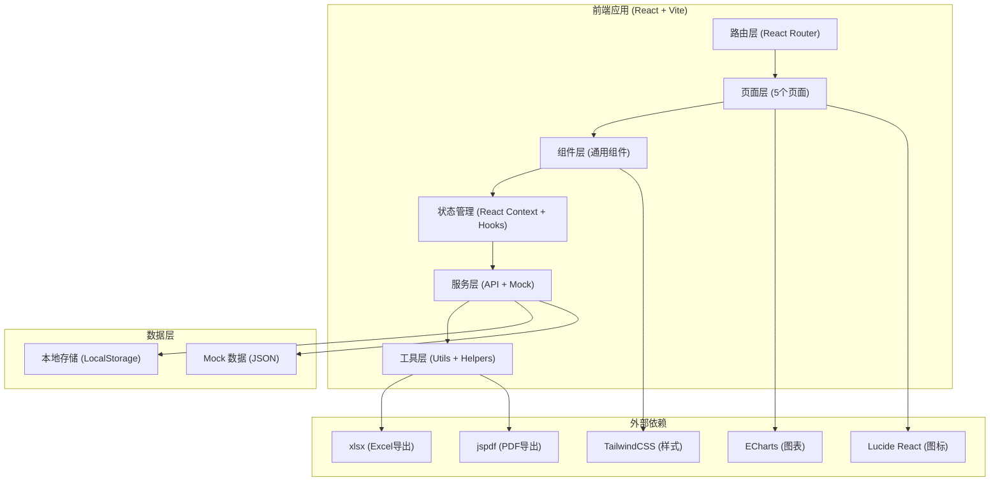
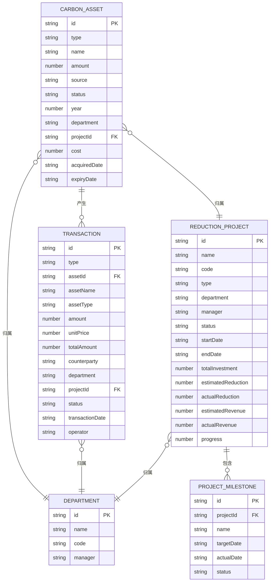

## 1. 架构设计



## 2. 技术描述

- **前端框架**: React@18.2.0 + TypeScript@5.0
- **构建工具**: Vite@5.0
- **样式方案**: TailwindCSS@3.4
- **路由管理**: React Router Dom@6.20
- **状态管理**: React Context + useReducer
- **图表库**: ECharts@5.4 + echarts-for-react@3.0
- **图标库**: Lucide React@0.294.0
- **数据导出**: xlsx@0.18.5 (Excel), jspdf@2.5.1 (PDF)
- **日期处理**: date-fns@2.30.0
- **后端服务**: 无后端，使用 Mock 数据 + LocalStorage 持久化
- **数据存储**: LocalStorage 存储用户操作数据，JSON 文件提供初始 Mock 数据

## 3. 路由定义

| 路由路径 | 页面名称 | 功能描述 |
|----------|----------|----------|
| `/dashboard` | 总览 | 数据仪表盘、指标概览、到期提醒、快捷操作 |
| `/assets` | 资产台账 | 碳资产列表、筛选查询、新增录入、详情查看 |
| `/transactions` | 交易记录 | 交易流水、买入卖出、履约抵扣、冻结解冻 |
| `/projects` | 减排项目 | 项目列表、进度追踪、收益预估、减排量核算 |
| `/reports` | 报表中心 | 月度盘点、履约测算、数据导出、自定义报表 |
| `*` | 404 页面 | 路由重定向到 `/dashboard` |

## 4. 数据类型定义

```typescript
// 碳资产类型
type AssetType = 'quota' | 'ccer' | 'other';
type AssetStatus = 'available' | 'frozen' | 'used' | 'expired';
type AssetSource = 'government' | 'purchase' | 'project' | 'transfer' | 'other';

interface CarbonAsset {
  id: string;
  type: AssetType;
  name: string;
  amount: number;
  unit: string;
  source: AssetSource;
  status: AssetStatus;
  year: number;
  department: string;
  projectId?: string;
  cost: number;
  acquiredDate: string;
  expiryDate?: string;
  description?: string;
  createdAt: string;
  updatedAt: string;
}

// 交易记录类型
type TransactionType = 'buy' | 'sell' | 'performance' | 'freeze' | 'unfreeze';
type TransactionStatus = 'pending' | 'completed' | 'cancelled';

interface Transaction {
  id: string;
  type: TransactionType;
  assetId: string;
  assetName: string;
  assetType: AssetType;
  amount: number;
  unitPrice?: number;
  totalAmount?: number;
  counterparty?: string;
  department: string;
  projectId?: string;
  status: TransactionStatus;
  transactionDate: string;
  remark?: string;
  operator: string;
  createdAt: string;
}

// 减排项目类型
type ProjectStatus = 'planning' | 'ongoing' | 'completed' | 'suspended';

interface ReductionProject {
  id: string;
  name: string;
  code: string;
  type: string;
  department: string;
  manager: string;
  status: ProjectStatus;
  startDate: string;
  endDate: string;
  totalInvestment: number;
  estimatedReduction: number;
  actualReduction: number;
  estimatedRevenue: number;
  actualRevenue: number;
  progress: number;
  milestones: ProjectMilestone[];
  description?: string;
  createdAt: string;
  updatedAt: string;
}

interface ProjectMilestone {
  id: string;
  name: string;
  targetDate: string;
  actualDate?: string;
  status: 'pending' | 'completed' | 'delayed';
}

// 报表类型
interface MonthlyReport {
  month: string;
  department: string;
  openingBalance: number;
  currentAdd: number;
  currentReduce: number;
  closingBalance: number;
  cost: number;
  revenue: number;
}

interface PerformanceReport {
  year: number;
  department: string;
  emissionTarget: number;
  actualEmission: number;
  availableQuota: number;
  availableCCER: number;
  gap: number;
  suggestedAction: string;
}

// 筛选条件
interface FilterParams {
  year?: number;
  type?: AssetType;
  status?: AssetStatus;
  source?: AssetSource;
  department?: string;
  projectId?: string;
  startDate?: string;
  endDate?: string;
  keyword?: string;
}
```

## 5. 数据模型 ER 图



## 6. Mock 数据设计

### 6.1 初始数据文件

| 文件名 | 数据内容 | 数据量 |
|--------|----------|--------|
| `assets.json` | 碳资产数据 | 约 50 条，覆盖不同类型、来源、状态 |
| `transactions.json` | 交易记录数据 | 约 80 条，覆盖所有交易类型 |
| `projects.json` | 减排项目数据 | 约 10 条，包含不同进度状态 |
| `departments.json` | 部门数据 | 约 5 个部门 |
| `users.json` | 用户数据 | 约 3 个不同角色用户 |

### 6.2 数据初始化策略

1. **首次加载**：应用启动时检查 LocalStorage 是否存在数据
2. **数据注入**：如无数据则从 JSON 文件读取并写入 LocalStorage
3. **操作持久化**：所有增删改操作同步更新 LocalStorage
4. **数据重置**：提供开发环境数据重置功能

## 7. 项目目录结构

```
src/
├── assets/              # 静态资源
│   ├── images/
│   └── styles/
├── components/          # 通用组件
│   ├── layout/         # 布局组件 (Sidebar, Header, Layout)
│   ├── ui/             # UI 组件 (Button, Card, Table, Modal, Form)
│   ├── charts/         # 图表组件 (LineChart, PieChart, BarChart)
│   └── common/         # 其他通用组件
├── context/            # 状态管理
│   ├── AssetContext.tsx
│   ├── TransactionContext.tsx
│   └── ProjectContext.tsx
├── data/               # Mock 数据
│   ├── assets.json
│   ├── transactions.json
│   ├── projects.json
│   └── departments.json
├── hooks/              # 自定义 Hooks
│   ├── useAssets.ts
│   ├── useTransactions.ts
│   ├── useProjects.ts
│   └── useReports.ts
├── pages/              # 页面组件
│   ├── Dashboard.tsx
│   ├── Assets.tsx
│   ├── Transactions.tsx
│   ├── Projects.tsx
│   └── Reports.tsx
├── router/             # 路由配置
│   └── index.tsx
├── types/              # TypeScript 类型定义
│   └── index.ts
├── utils/              # 工具函数
│   ├── storage.ts
│   ├── format.ts
│   ├── export.ts
│   └── validator.ts
├── App.tsx
└── main.tsx
```

## 8. 前端性能优化策略

1. **代码分割**：按页面级进行路由懒加载，减少首屏加载体积
2. **数据缓存**：使用 React Context + useMemo 缓存计算结果
3. **虚拟列表**：表格数据超过 50 条时启用虚拟滚动
4. **图表优化**：ECharts 启用懒加载和自适应重绘
5. **防抖节流**：搜索、筛选输入使用防抖处理
6. **按需加载**：图标、工具函数按需导入，避免全量引入
7. **样式优化**：TailwindCSS JIT 模式，按需生成样式
